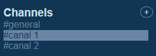

# APP-Mensajeria-Interactiva

## Description
El presente trabajo fue desarrollado como proyecto final para completar el Bootcamp: 'Programación desde Cero', de Geekshubs Academy.
El objetivo planteado por Geekshubs fue desarrollar la interfaz y las interacciones de una aplicación de mensajería.

## Table of contents
- [Instalation :electric_plug:](#instalation)
- [Usage :green_book:](#usage)
- [Authors :blush:](#authors)
- [License :white_check_mark:](#license)

 

## Instalation
Dado que esta página web utiliza HTML, CSS y JavaScript, esta aplicación correrá en cualquier navegador sin la necesidad de la instalación de aplicaciones adicionales. 
 

## Usage
#### LINK DE INGRESO
Para iniciar la aplicación se debe ingresar al siguiente link: https://diego-liosi.github.io/APP-Mensajeria-Interactiva/

#### INGRESO NOMBRE DE USUARIO
Al iniciar la aplicación, se observará una ventana emergente que nos solicita el ingreso de nuestro nombre de usuario.

En la misma introducir el nombre y pulsar el botón *Aceptar*.
 
#### VISTA GLOBAL
La vista principal cuenta con:

 - [A - Area de Canales :satellite:](#area-de-canales)
 - [B - Nuevos Mensajes :speech_balloon:](#nuevos-mensajes)
 - [C- Search o Busqueda :mag_right:](#search-o-busqueda)

Es importante aclarar que los apartados de **Direct Messages** y **Apps**, no cuentan aún con funcionalidad, aparecen solo a modo de relleno.
 

##### *AREA DE CANALES*
Aquí es donde se observan el listado de canales.
Por default el canal seleccionado es el "#general". 

###### *Adicionar un nuevo canal*
Pulsar el botón (+) que esta junto a Channels.

Se desplegará un input donde se debe ingresar el nombre del nuevo canal que se desea sumar al listado, y luego pulsar el botón que está junto al cuadro 

Finalmente el Canal aparecerá al final del listado.

###### *Cambiar de Canal*
Posicionar el cursor del mouse sobre el canal que se desea seleccionar y hacer click sobre este.

El canal seleccionado permanecerá marcado como se observa en la figura. 
 

##### *NUEVOS MENSAJES*

Escribir el nuevo mensaje en el siguiente input y luego pulsar "ENTER" o hacer click en el botón contiguo (+).

 El mensaje aparecerá en el cuerpo de la página, detallando el *Usuario, la Fecha y la Hora*.

 
 

##### *SEARCH O BUSQUEDA*
La página cuenta con un Search que permite buscar una palabra en todos los canales. 

Para realizar la búsqueda, se debe ingresar la palabra a buscar en el siguiente input y pulsar la tecla "ENTER".

La página devolverá el canal donde la encuentra la palabra requerida.

 

## Authors
Esta página web fue desarrollada en su totalidad por Diego Liosi.

## License

<a href="LICENSE">[MIT]</a>

 

# [TOP:top:](#table-of-contents)